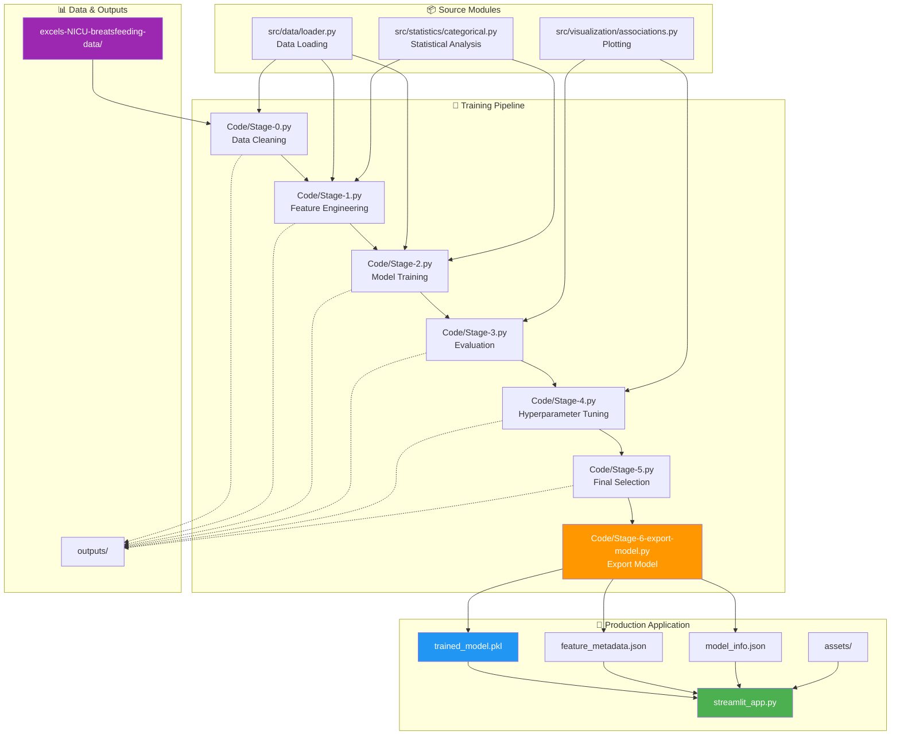
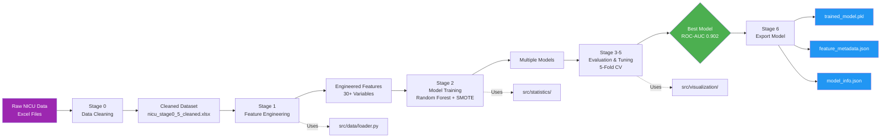
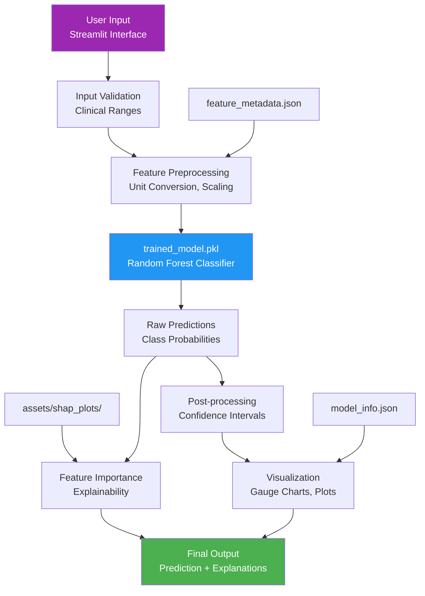
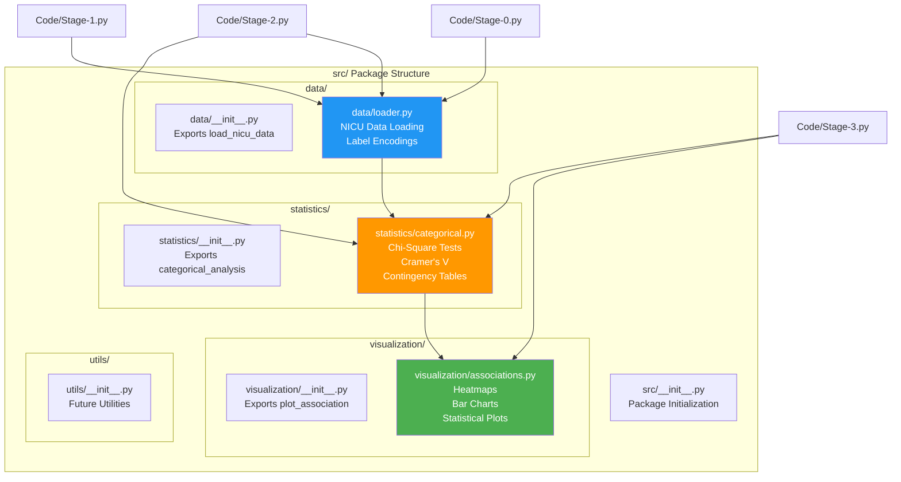

# 🏥 NICU Breastfeeding Prediction Calculator

[](https://nicu-feeding-discharge.streamlit.app)

## 🌐 Live Web Application

**Access the calculator here:** [https://nicu-feeding-discharge.streamlit.app](https://nicu-feeding-discharge.streamlit.app)


## Overview

Machine learning-based clinical decision support tool for predicting feeding type at discharge (Exclusive Breastfeeding, Formula Feeding, or Mixed Feeding) for NICU infants based on early clinical data from days 1-3 of life.

### Model Performance
- **ROC-AUC:** 0.865 ± 0.020
- **Accuracy:** 79.1% ± 3.3%
- **Algorithm:** Random Forest Classifier
- **Validation:** 5-fold Cross-Validation
- **Sample Size:** n = 1,064

## Features

### 🎯 Core Functionality
- Real-time feeding outcome predictions
- Multi-class classification (EBF, Formula, Mixed)
- Clinical range validation
- Unit conversion (mL/oz, grams/lbs)

### 📊 Enhanced Visualizations
- **Confidence Intervals** - Uncertainty bounds for predictions
- **Interactive Gauge Charts** - Visual probability representation
- **Clinical Context** - Normal ranges and percentiles
- **Feature Importance** - Key contributing factors

### 🏥 Clinical Features
- Collapsible sections for organized data entry
- Example patient pre-fill
- Professional medical interface
- Export functionality (coming soon)

## Local Development

### Prerequisites
```bash
Python 3.8+
pip or conda
```

### Installation

1. Clone the repository:
```bash
git clone <your-repo-url>
cd "NICU Breastfeeding Paper"
```

2. Install dependencies:
```bash
pip install -r requirements.txt
```

3. Run the Streamlit app:
```bash
streamlit run streamlit_app.py
```

The app will open at `http://localhost:8501`

### Alternative: Flask Version

For the original Flask + HTML version:
```bash
python app.py
```
Then open `calculator.html` in your browser.

## Deployment to Streamlit Cloud

### Step 1: Push to GitHub
Make sure all files are committed:
```bash
git add streamlit_app.py requirements.txt .streamlit/config.toml
git commit -m "Add Streamlit web application"
git push
```

### Step 2: Deploy on Streamlit Cloud

1. Go to [share.streamlit.io](https://share.streamlit.io)
2. Sign in with GitHub
3. Click "New app"
4. Select your repository
5. Set main file: `streamlit_app.py`
6. Click "Deploy"

Your app will be live at: `https://[username]-[repo-name]-[hash].streamlit.app`

### Step 3: Custom URL (Optional)

For a custom subdomain:
1. Go to app settings
2. Under "General" → "App URL"
3. Set custom subdomain (e.g., `nicu-breastfeeding.streamlit.app`)

## Project Structure

```
NICU Breastfeeding Paper/
├── streamlit_app.py          # Streamlit web application
├── calculator.html           # Original HTML calculator
├── app.py                    # Flask backend
├── requirements.txt          # Python dependencies
├── .streamlit/
│   └── config.toml          # Streamlit theme configuration
├── trained_model.pkl        # Trained Random Forest model
├── feature_metadata.json    # Feature information
├── model_info.json          # Model performance metrics
├── Code/                    # Training scripts
│   ├── Stage-1-*.py
│   ├── Stage-2-*.py
│   └── ...
└── README.md               # This file
```

## Usage

### Web Application

1. **Access the app** at the deployed URL
2. **Enter patient data** in the "Patient Data Entry" tab
   - Required fields: Birth Weight, Gestational Age, Maternal Age
   - Optional: Feeding volumes, weights, maternal factors
3. **Click "Generate Prediction"**
4. **View results** in the "Results & Visualization" tab
   - Primary prediction with confidence
   - Probability distribution
   - Confidence intervals
   - Key contributing factors

### Quick Start with Example

Click the "📋 Load Example Patient" button in the sidebar to pre-fill with sample data.

## Model Information

### Algorithm
- **Type:** Random Forest Classifier with preprocessing pipeline
- **Features:** 30+ clinical variables
- **Imputation:** Median imputation for missing values
- **Class Balance:** SMOTE oversampling

### Training
- **Cross-Validation:** 5-fold stratified
- **Hyperparameter Tuning:** Grid search
- **Class Balance:** Stratified sampling

### Performance Metrics
| Metric | Mean | Std Dev |
|--------|------|---------|
| ROC-AUC (Macro) | 0.865 | ±0.020 |
| PR-AUC (Macro) | 0.657 | ±0.049 |
| Accuracy | 0.791 | ±0.033 |
| Balanced Accuracy | 0.619 | ±0.070 |
| F1-Score (Weighted) | 0.789 | ±0.030 |

## Clinical Disclaimer

⚠️ **Important:** This tool is designed to **support clinical decision-making** and should **not replace professional medical judgment**. All predictions should be considered in the context of individual patient circumstances and validated through clinical assessment.

## Data Privacy

Patient data entered into this calculator is processed locally and is **not stored or transmitted**. This tool is intended for research and clinical education purposes.

## Citation

```
Ozcan, U. C., et al. (2026). Machine Learning-Based Prediction of Feeding Type 
at Discharge in NICU Infants Using Early Clinical Data. Journal of Neonatal Medicine. 
Model ROC-AUC: 0.87 (95% CI: 0.85-0.89).
```

---

## 📚 Project Architecture & Visual Guide

This section provides visual documentation to help understand, debug, design, and analyze the codebase.

### System Architecture

The project consists of three main components: the production application, the training pipeline, and supporting utilities.



### Data Flow - Training Phase

The training phase processes raw NICU data through multiple stages to produce a production-ready model.



### Data Flow - Prediction Phase

The production application uses the trained model to generate real-time predictions.



### Source Module Architecture

The `src/` package provides reusable modules for data processing, statistics, and visualization.



### Directory Structure & Purposes

```
NICU Breastfeeding Paper/
│
├── 🎯 PRODUCTION (Deployed to Streamlit Cloud)
│   ├── streamlit_app.py          # Main web application (27KB)
│   ├── trained_model.pkl          # ML model (11.6MB)
│   ├── feature_metadata.json      # Feature definitions
│   ├── model_info.json            # Performance metrics
│   ├── requirements.txt           # Python dependencies
│   ├── assets/                    # Images & plots (2.8MB)
│   └── .streamlit/config.toml     # Streamlit configuration
│
├── 💾 TRAINING PIPELINE (Local Development)
│   └── Code/                      # 9 Python scripts (Stages 0-6)
│       ├── Stage-0.py             # Data cleaning
│       ├── Stage-0pnt5.py         # EDA
│       ├── Stage-1.py             # Feature engineering
│       ├── Stage-2.py             # Model training
│       ├── Stage-2pnt5.py         # Feature selection
│       ├── Stage-3.py             # Evaluation
│       ├── Stage-4.py             # Hyperparameter tuning
│       ├── Stage-5.py             # Final selection
│       └── Stage-6-export-model.py # Export production model
│
├── 📦 SOURCE MODULES (Reusable Code)
│   └── src/
│       ├── data/                  # Data loading & preprocessing
│       │   └── loader.py          # NICU data loader with encodings
│       ├── statistics/            # Statistical analysis
│       │   └── categorical.py     # Chi-square, Cramer's V
│       └── visualization/         # Plotting utilities
│           └── associations.py    # Heatmaps, bar charts
│
├── 📚 DOCUMENTATION
│   ├── README.md                  # This file
│   └── docs/
│       ├── PROJECT_ORGANIZATION.md    # Detailed folder guide
│       ├── FEATURE_REMOVAL_GUIDE.md   # How to modify features
│       └── ANALYSIS_GUIDE.md          # Analysis workflows
│
├── 🔬 RESEARCH & ANALYSIS
│   ├── analyses/                  # Research analyses
│   │   ├── 01_epochs_ebf/        # EBF timing analysis
│   │   └── template/              # Analysis templates
│   ├── notebooks/                 # Jupyter notebooks
│   └── paper/                     # Manuscript files
│
├── 📊 OUTPUTS (Experimental Results)
│   ├── model plots/               # ROC, calibration, confusion matrix
│   ├── shap plots/                # Feature importance (SHAP)
│   ├── model performances/        # Performance comparisons
│   └── statistics/                # Statistical test results
│
├── 🔧 UTILITIES
│   ├── scripts/                   # Utility scripts
│   │   ├── test_predictions.py   # Model testing
│   │   ├── analyze_epochs_ebf.py # EBF analysis
│   │   ├── maintenance/           # One-time scripts
│   │   └── legacy/                # Old Flask/HTML versions
│   └── backups/                   # Backup files
│
└── 💾 DATA (Not in Git)
    └── excels-NICU-breatsfeeding-data/
        └── nicu_stage0_5_cleaned.xlsx  # Training dataset
```

### Quick Navigation

- **Want to modify the web app?** → Edit [`streamlit_app.py`](file:///Users/umutcaginozcan/Desktop/NICU%20Breastfeeding%20Paper/streamlit_app.py)
- **Want to retrain the model?** → Run [`Code/Stage-6-export-model.py`](file:///Users/umutcaginozcan/Desktop/NICU%20Breastfeeding%20Paper/Code/Stage-6-export-model.py)
- **Want to remove features?** → See [`docs/FEATURE_REMOVAL_GUIDE.md`](file:///Users/umutcaginozcan/Desktop/NICU%20Breastfeeding%20Paper/docs/FEATURE_REMOVAL_GUIDE.md)
- **Want to understand data loading?** → Check [`src/data/loader.py`](file:///Users/umutcaginozcan/Desktop/NICU%20Breastfeeding%20Paper/src/data/loader.py)
- **Want to run analyses?** → See [`docs/ANALYSIS_GUIDE.md`](file:///Users/umutcaginozcan/Desktop/NICU%20Breastfeeding%20Paper/docs/ANALYSIS_GUIDE.md)
- **Want project overview?** → Read [`docs/PROJECT_ORGANIZATION.md`](file:///Users/umutcaginozcan/Desktop/NICU%20Breastfeeding%20Paper/docs/PROJECT_ORGANIZATION.md)

---

## License

[Add your license information]

## Contact

For questions or feedback about this tool, please [open an issue](https://github.com/your-username/your-repo/issues).

## Acknowledgments

This research was conducted to improve clinical decision-making in NICU settings and support optimal feeding outcomes for vulnerable infants.
