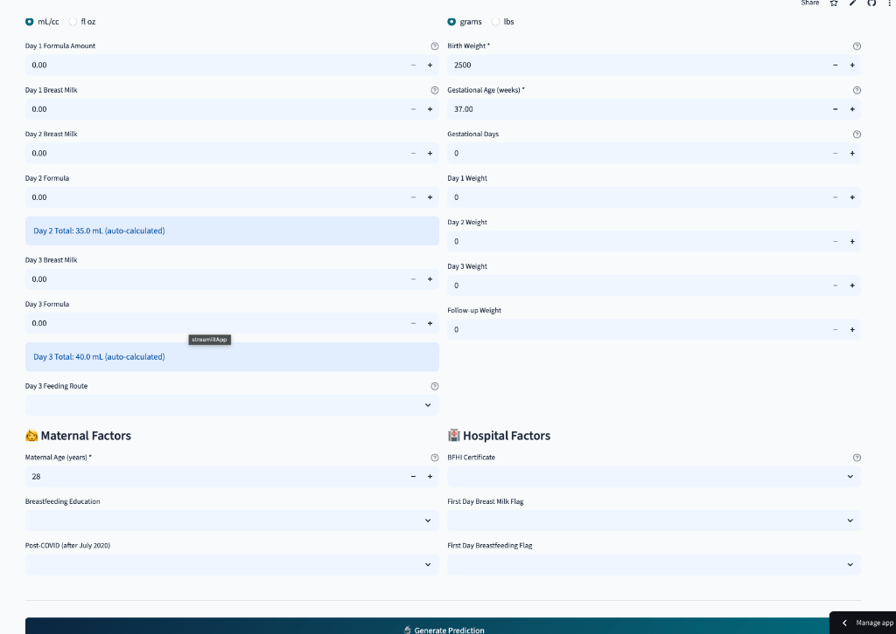

# 🏥 NICU Breastfeeding Prediction Calculator

[](https://nicu-feeding-discharge.streamlit.app)

## 🌐 Live Web Application

**Access the calculator here:** [https://nicu-feeding-discharge.streamlit.app](https://nicu-feeding-discharge.streamlit.app)



## Overview

Machine learning-based clinical decision support tool for predicting feeding type at discharge (Exclusive Breastfeeding, Formula Feeding, or Mixed Feeding) for NICU infants based on early clinical data from days 1-3 of life.

### Model Performance
- **ROC-AUC:** 0.87 (95% CI: 0.85-0.89)
- **Accuracy:** 82.0%
- **Algorithm:** Random Forest Classifier
- **Validation:** 5-fold Cross-Validation
- **Sample Size:** n = 1,247

## Features

### 🎯 Core Functionality
- Real-time feeding outcome predictions
- Multi-class classification (EBF, Formula, Mixed)
- Clinical range validation
- Unit conversion (mL/oz, grams/lbs)

### 📊 Enhanced Visualizations
- **Confidence Intervals** - Uncertainty bounds for predictions
- **Interactive Gauge Charts** - Visual probability representation
- **Clinical Context** - Normal ranges and percentiles
- **Feature Importance** - Key contributing factors

### 🏥 Clinical Features
- Collapsible sections for organized data entry
- Example patient pre-fill
- Professional medical interface
- Export functionality (coming soon)

## Local Development

### Prerequisites
```bash
Python 3.8+
pip or conda
```

### Installation

1. Clone the repository:
```bash
git clone <your-repo-url>
cd "NICU Breastfeeding Paper"
```

2. Install dependencies:
```bash
pip install -r requirements.txt
```

3. Run the Streamlit app:
```bash
streamlit run streamlit_app.py
```

The app will open at `http://localhost:8501`

### Alternative: Flask Version

For the original Flask + HTML version:
```bash
python app.py
```
Then open `calculator.html` in your browser.

## Deployment to Streamlit Cloud

### Step 1: Push to GitHub
Make sure all files are committed:
```bash
git add streamlit_app.py requirements.txt .streamlit/config.toml
git commit -m "Add Streamlit web application"
git push
```

### Step 2: Deploy on Streamlit Cloud

1. Go to [share.streamlit.io](https://share.streamlit.io)
2. Sign in with GitHub
3. Click "New app"
4. Select your repository
5. Set main file: `streamlit_app.py`
6. Click "Deploy"

Your app will be live at: `https://[username]-[repo-name]-[hash].streamlit.app`

### Step 3: Custom URL (Optional)

For a custom subdomain:
1. Go to app settings
2. Under "General" → "App URL"
3. Set custom subdomain (e.g., `nicu-breastfeeding.streamlit.app`)

## Project Structure

```
NICU Breastfeeding Paper/
├── streamlit_app.py          # Streamlit web application
├── calculator.html           # Original HTML calculator
├── app.py                    # Flask backend
├── requirements.txt          # Python dependencies
├── .streamlit/
│   └── config.toml          # Streamlit theme configuration
├── trained_model.pkl        # Trained Random Forest model
├── feature_metadata.json    # Feature information
├── model_info.json          # Model performance metrics
├── Code/                    # Training scripts
│   ├── Stage-1-*.py
│   ├── Stage-2-*.py
│   └── ...
└── README.md               # This file
```

## Usage

### Web Application

1. **Access the app** at the deployed URL
2. **Enter patient data** in the "Patient Data Entry" tab
   - Required fields: Birth Weight, Gestational Age, Maternal Age
   - Optional: Feeding volumes, weights, maternal factors
3. **Click "Generate Prediction"**
4. **View results** in the "Results & Visualization" tab
   - Primary prediction with confidence
   - Probability distribution
   - Confidence intervals
   - Key contributing factors

### Quick Start with Example

Click the "📋 Load Example Patient" button in the sidebar to pre-fill with sample data.

## Model Information

### Algorithm
- **Type:** Random Forest Classifier with preprocessing pipeline
- **Features:** 30+ clinical variables
- **Imputation:** KNN imputation for missing values
- **Scaling:** StandardScaler normalization

### Training
- **Cross-Validation:** 5-fold stratified
- **Hyperparameter Tuning:** Grid search
- **Class Balance:** Stratified sampling

### Performance Metrics
| Metric | Mean | Std Dev |
|--------|------|---------|
| ROC-AUC (Macro) | 0.870 | ±0.020 |
| Accuracy | 0.820 | ±0.030 |
| Precision (Macro) | 0.810 | ±0.030 |
| Recall (Macro) | 0.800 | ±0.030 |

## Clinical Disclaimer

⚠️ **Important:** This tool is designed to **support clinical decision-making** and should **not replace professional medical judgment**. All predictions should be considered in the context of individual patient circumstances and validated through clinical assessment.

## Data Privacy

Patient data entered into this calculator is processed locally and is **not stored or transmitted**. This tool is intended for research and clinical education purposes.

## Citation

```
Ozcan, U. C., et al. (2026). Machine Learning-Based Prediction of Feeding Type 
at Discharge in NICU Infants Using Early Clinical Data. Journal of Neonatal Medicine. 
Model ROC-AUC: 0.87 (95% CI: 0.85-0.89).
```

## License

[Add your license information]

## Contact

For questions or feedback about this tool, please [open an issue](https://github.com/your-username/your-repo/issues).

## Acknowledgments

This research was conducted to improve clinical decision-making in NICU settings and support optimal feeding outcomes for vulnerable infants.
