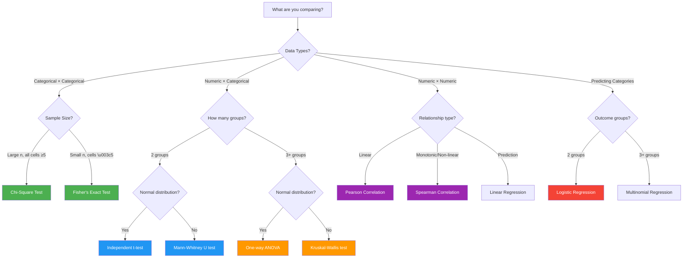

# Comprehensive Statistical Analysis Guide

## 📚 Purpose

This guide teaches you **which statistical test to use and why** for analyzing medical research data. It covers test selection, assumptions, interpretation, and reporting in medical journals.

---

## 🎯 Quick Test Selection Guide



---

## 📊 Statistical Tests Explained

### 1. Chi-Square Test (χ²)

**When to use:** Testing association between two categorical variables

**Example Research Questions:**
- Is feeding type associated with maternal education level?
- Do COVID-19 periods show different feeding outcome distributions?
- Is diagnosis group related to gestational age category?

**How it works:**

The chi-square test compares **observed frequencies** (what you actually see in your data) with **expected frequencies** (what you'd see if there was no association).

**Formula:**
```
χ² = Σ [(Observed - Expected)² / Expected]

Expected for each cell = (Row Total × Column Total) / Grand Total
```

**Assumptions:**
1. ✓ Independence: Each observation appears only once
2. ✓ Sample size: Expected frequency ≥ 5 in at least 80% of cells
3. ✓ Categorical data: Both variables are categorical

**If assumptions violated:**
- Small expected frequencies (\u003c5): Use **Fisher's Exact Test**
- Ordinal categories: Consider **Mantel-Haenszel test**

**Interpreting Results:**

| p-value | Interpretation |
|---------|----------------|
| \u003c 0.001 | Highly significant association |
| 0.001-0.01 | Very significant association |
| 0.01-0.05 | Significant association |
| ≥ 0.05 | No significant association |

**Effect Size: Cramér's V**
```
V = √(χ² / (n × (min(rows-1, cols-1))))
```

| Cramér's V | Interpretation |
|------------|----------------|
| 0.00-0.10 | Negligible |
| 0.10-0.30 | Weak |
| 0.30-0.50 | Moderate |
| 0.50+ | Strong |

**Reporting (Medical Journal Format):**

> "A chi-square test revealed a significant association between feeding type at discharge and COVID-19 period (χ²(2) = 203.67, p \u003c 0.001, Cramér's V = 0.44). Post-COVID infants had higher rates of mixed feeding (52.1%) compared to pre-COVID infants (21.4%)."

---

### 2. Fisher's Exact Test

**When to use:** Chi-square with small sample sizes or expected frequencies \u003c 5

**Advantages:**
- Exact p-value (not asymptotic approximation)
- Valid for small samples
- No minimum sample size requirement

**Limitations:**
- Computationally intensive for large tables
- Typically used for 2×2 tables

**Example:**
```python
from scipy.stats import fisher_exact

# 2×2 contingency table
table = [[10, 5],
         [3, 12]]
         
odds_ratio, p_value = fisher_exact(table)
print(f"Odds Ratio: {odds_ratio:.2f}, p-value: {p_value:.4f}")
```

**Reporting:**

> "Fisher's exact test showed a significant association between breast problems and feeding outcome (p = 0.032, OR = 2.8, 95% CI [1.1, 7.2])."

---

### 3. Independent t-test

**When to use:** Comparing means of a continuous variable between two independent groups

**Example Research Questions:**
- Do exclusive breastfed infants have different birth weights than formula-fed infants?
- Is maternal age different between pre-COVID and post-COVID periods?
- Does gestational age differ by delivery method?

**Assumptions:**
1. ✓ Independence: Groups are independent (not paired)
2. ✓ Normality: Data in each group is approximately normally distributed
3. ✓ Homogeneity of variance: Equal variances in both groups

**Testing Assumptions:**

**Normality:**
```python
from scipy.stats import shapiro

# Shapiro-Wilk test for normality
stat, p = shapiro(group1_data)
if p \u003e 0.05:
    print("Data is normally distributed")
```

**Equal Variances:**
```python
from scipy.stats import levene

# Levene's test for equal variances
stat, p = levene(group1_data, group2_data)
if p \u003e 0.05:
    print("Variances are equal - use standard t-test")
else:
    print("Variances are unequal - use Welch's t-test")
```

**Running the Test:**
```python
from scipy.stats import ttest_ind

# Standard t-test (equal variances)
t_stat, p_value = ttest_ind(group1, group2)

# Welch's t-test (unequal variances)
t_stat, p_value = ttest_ind(group1, group2, equal_var=False)
```

**Effect Size: Cohen's d**
```
d = (Mean₁ - Mean₂) / Pooled SD

Pooled SD = √[(SD₁² + SD₂²) / 2]
```

| Cohen's d | Interpretation |
|-----------|----------------|
| 0.0-0.2 | Negligible |
| 0.2-0.5 | Small |
| 0.5-0.8 | Medium |
| 0.8+ | Large |

**Reporting:**

> "Birth weight was significantly higher in exclusive breastfed infants (M = 3245g, SD = 512) compared to formula-fed infants (M = 2987g, SD = 623), t(421) = 4.82, p \u003c 0.001, d = 0.45, 95% CI [152, 364]."

---

### 4. Mann-Whitney U Test

**When to use:** Non-parametric alternative to t-test when normality assumption is violated

**Advantages:**
- No normality assumption
- Robust to outliers
- Works with ordinal data

**How it works:**
- Ranks all data from both groups
- Compares sum of ranks between groups

```python
from scipy.stats import mannwhitneyu

u_stat, p_value = mannwhitneyu(group1, group2, alternative='two-sided')
```

**Effect Size: Rank-biserial correlation**
```
r = 1 - (2U) / (n₁ × n₂)
```

**Reporting:**

> "Length of stay was significantly longer in the formula group (Mdn = 7 days) than in the exclusive breastfeeding group (Mdn = 5 days), U = 12453, p = 0.003, r = 0.28."

---

### 5. One-Way ANOVA

**When to use:** Comparing means across 3 or more independent groups

**Example Research Questions:**
- Does birth weight differ across the three time epochs?
- Is maternal age different across feeding type groups?
- Do feeding volumes on day 1 vary by diagnosis group?

**Assumptions:**
1. ✓ Independence: Groups are independent
2. ✓ Normality: Data in each group is normally distributed
3. ✓ Homogeneity of variance: Equal variances across all groups

**Running ANOVA:**
```python
from scipy.stats import f_oneway

# One-way ANOVA
f_stat, p_value = f_oneway(group1, group2, group3)
```

**If significant, do post-hoc tests:**
```python
from scipy.stats import ttest_ind
from statsmodels.stats.multitest import multipletests

# All pairwise comparisons
comparisons = [
    ('Group 1 vs 2', ttest_ind(group1, group2)[1]),
    ('Group 1 vs 3', ttest_ind(group1, group3)[1]),
    ('Group 2 vs 3', ttest_ind(group2, group3)[1])
]

# Bonferroni correction
p_values = [p for _, p in comparisons]
corrected = multipletests(p_values, method='bonferroni')[1]
```

**Effect Size: Eta-squared (η²)**
```
η² = SS_between / SS_total
```

| η² | Interpretation |
|----|----------------|
| 0.01 | Small |
| 0.06 | Medium |
| 0.14+ | Large |

**Reporting:**

> "A one-way ANOVA revealed a significant effect of epoch on birth weight, F(2, 1061) = 15.32, p \u003c 0.001, η² = 0.028. Post-hoc comparisons with Bonferroni correction showed that post-COVID infants had significantly higher birth weights than both pre-COVID epochs (p \u003c 0.001)."

---

### 6. Kruskal-Wallis Test

**When to use:** Non-parametric alternative to ANOVA

**Advantages:**
- No normality assumption
- Robust to outliers
- Works with ordinal data

```python
from scipy.stats import kruskal

h_stat, p_value = kruskal(group1, group2, group3)
```

**Post-hoc tests:**
```python
from scikit_posthocs import posthoc_dunn

# Dunn's test with Bonferroni correction
dunn_results = posthoc_dunn([group1, group2, group3], p_adjust='bonferroni')
```

**Reporting:**

> "A Kruskal-Wallis test indicated significant differences in length of stay across feeding types, H(2) = 23.45, p \u003c 0.001. Dunn's post-hoc tests showed exclusive breastfed infants had shorter stays than both formula (p \u003c 0.01) and mixed feeding groups (p = 0.03)."

---

### 7. Pearson Correlation

**When to use:** Measuring linear relationship between two continuous variables

**Example Research Questions:**
- Is there a correlation between birth weight and gestational age?
- How does maternal age relate to number of previous children?
- Is day 1 feeding volume correlated with day 3 volume?

**Assumptions:**
1. ✓ Linearity: Relationship is linear
2. ✓ Normality: Both variables are normally distributed
3. ✓ No outliers: Extreme values can distort correlation

**Running Correlation:**
```python
from scipy.stats import pearsonr

r, p_value = pearsonr(variable1, variable2)
```

**Interpreting r:**

| |r| | Interpretation |
|------|----------------|
| 0.0-0.1 | Negligible |
| 0.1-0.3 | Weak |
| 0.3-0.5 | Moderate |
| 0.5-0.7 | Strong |
| 0.7-0.9 | Very strong |
| 0.9-1.0 | Nearly perfect |

**Coefficient of Determination (R²):**
- R² = proportion of variance explained
- R² = r² (for simple correlation)

**Reporting:**

> "Birth weight was strongly positively correlated with gestational age, r = 0.72, p \u003c 0.001, 95% CI [0.68, 0.75], R² = 0.52."

---

### 8. Spearman Correlation

**When to use:** Measuring monotonic (not necessarily linear) relationship, or with ordinal data

**Advantages:**
- No normality assumption
- Robust to outliers
- Works with ranks/ordinal data

```python
from scipy.stats import spearmanr

rho, p_value = spearmanr(variable1, variable2)
```

**Reporting:**

> "There was a moderate positive monotonic relationship between maternal education level and breastfeeding duration, ρ = 0.34, p \u003c 0.001."

---

### 9. Linear Regression

**When to use:** Predicting a continuous outcome from one or more predictors

**Simple Linear Regression (1 predictor):**
```python
from scipy.stats import linregress

slope, intercept, r_value, p_value, std_err = linregress(x, y)
```

**Multiple Linear Regression:**
```python
import statsmodels.api as sm

# Add constant for intercept
X = sm.add_constant(predictors)
model = sm.OLS(outcome, X).fit()
print(model.summary())
```

**Model Evaluation:**
- **R²**: Proportion of variance explained (0-1)
- **Adjusted R²**: R² adjusted for number of predictors
- **F-statistic**: Overall model significance
- **p-values**: Significance of individual predictors

**Assumptions:**
1. ✓ Linearity: Relationship is linear
2. ✓ Independence: Residuals are independent
3. ✓ Homoscedasticity: Constant variance of residuals
4. ✓ Normality: Residuals are normally distributed
5. ✓ No multicollinearity: Predictors not highly correlated

**Reporting:**

> "Multiple linear regression revealed that birth weight was significantly predicted by gestational age and maternal age, F(2, 1061) = 245.3, p \u003c 0.001, R² = 0.316. Gestational age was the strongest predictor (β = 0.54, p \u003c 0.001), followed by maternal age (β = 0.12, p = 0.003)."

---

### 10. Logistic Regression

**When to use:** Predicting a binary categorical outcome from predictors

**Example Research Questions:**
- What factors predict exclusive breastfeeding vs. not?
- Can we predict BFHI success based on maternal and infant factors?
- What predicts early breastfeeding initiation?

```python
import statsmodels.api as sm

# Binary outcome (0/1)
X = sm.add_constant(predictors)
model = sm.Logit(binary_outcome, X).fit()
print(model.summary())
```

**Interpreting Coefficients:**
- **Odds Ratio (OR)**: exp(coefficient)
- OR \u003e 1: Increased odds
- OR \u003c 1: Decreased odds
- OR = 1: No effect

**Model Evaluation:**
- **Pseudo-R²**: Model fit (various types: McFadden, Nagelkerke)
- **AIC/BIC**: Model comparison (lower is better)
- **ROC-AUC**: Discrimination ability (0.5-1.0)

**Reporting:**

> "Logistic regression identified significant predictors of exclusive breastfeeding. Post-COVID period (OR = 3.45, 95% CI [2.12, 5.63], p \u003c 0.001), higher maternal education (OR = 2.21, 95% CI [1.45, 3.37], p \u003c 0.001), and day 1 breastfeeding (OR = 6.78, 95% CI [4.23, 10.87], p \u003c 0.001) were associated with increased odds of exclusive breastfeeding. The model showed good discrimination (AUC = 0.82, 95% CI [0.79, 0.85])."

---

## 🔍 Multiple Testing Corrections

When performing multiple statistical tests, the chance of false positives increases. Use corrections:

### Bonferroni Correction

**Most conservative approach**
```
Adjusted p-value = Original p × Number of tests
Reject if: Adjusted p \u003c 0.05
```

**Example:**
- 3 pairwise comparisons
- Original p-values: 0.008, 0.023, 0.154
- Adjusted: 0.024, 0.069, 0.462
- Only first comparison remains significant

### False Discovery Rate (FDR/Benjamini-Hochberg)

**Less conservative, controls proportion of false discoveries**

```python
from statsmodels.stats.multitest import multipletests

p_values = [0.008, 0.023, 0.045, 0.154]
reject, p_corrected, _, _ = multipletests(p_values, method='fdr_bh')
```

**When to use:**
- Bonferroni: Few tests, want to be very conservative
- FDR: Many tests, exploratory analysis

---

## 📈 Checking Assumptions

### Normality Tests

**Visual Inspection (Preferred):**
```python
import matplotlib.pyplot as plt
from scipy import stats

# Histogram
plt.hist(data, bins=30, edgecolor='black')
plt.show()

# Q-Q plot
stats.probplot(data, dist="norm", plot=plt)
plt.show()
```

**Statistical Tests:**
```python
from scipy.stats import shapiro, normaltest

# Shapiro-Wilk (n \u003c 50)
stat, p = shapiro(data)

# D'Agostino-Pearson (n \u003e 50)
stat, p = normaltest(data)

if p \u003e 0.05:
    print("Data appears normally distributed")
```

**If not normal:**
- Transform data (log, sqrt, box-cox)
- Use non-parametric test
- Increase sample size (Central Limit Theorem)

### Homogeneity of Variance

**Levene's Test:**
```python
from scipy.stats import levene

stat, p = levene(group1, group2, group3)
if p \u003e 0.05:
    print("Variances are equal")
```

**If variances unequal:**
- Use Welch's t-test instead of standard t-test
- Use Welch's ANOVA instead of standard ANOVA

---

## 📝 Reporting Checklist

### For All Tests:
- [ ] Test name and purpose
- [ ] Sample sizes for each group
- [ ] Test statistic and degrees of freedom
- [ ] Exact p-value (or p \u003c 0.001)
- [ ] Effect size with interpretation
- [ ] Confidence intervals (when applicable)
- [ ] Direction of effect

### For Figures:
- [ ] Clear axis labels with units
- [ ] Sample sizes in legend or caption
- [ ] Error bars defined (SD, SE, or CI)
- [ ] Statistical significance markers (*, **, ***)
- [ ] High resolution (≥300 DPI for print)

### Medical Journal Standards:

**Significance Markers:**
- \* p \u003c 0.05
- \*\* p \u003c 0.01
- \*\*\* p \u003c 0.001
- NS = not significant

**Numeric Reporting:**
- Report exact p-values (e.g., p = 0.023, not p \u003c 0.05)
- Exception: Report p \u003c 0.001 for very small values
- 2-3 decimal places for statistics
- Means with ± SD or ± SE
- Medians with IQR or range

---

## 🎓 Statistical Power & Sample Size

**Power Analysis helps determine:**
- Minimum sample size needed
- Probability of detecting real effects

**Components:**
1. **α (Alpha)**: Significance level (usually 0.05)
2. **β (Beta)**: Type II error rate (usually 0.20)
3. **Power**: 1 - β (usually 0.80 or 80%)
4. **Effect size**: Expected magnitude of difference

```python
from statsmodels.stats.power import tt_ind_solve_power

# Calculate required sample size
n = tt_ind_solve_power(
    effect_size=0.5,  # Cohen's d
    alpha=0.05,
    power=0.80,
    alternative='two-sided'
)
print(f"Required n per group: {n:.0f}")
```

---

## 📚 Quick Reference Table

| Research Question | Test | Assumptions | Effect Size |
|------------------|------|-------------|-------------|
| Cat × Cat association | Chi-square | Expected ≥5 | Cramér's V |
| Cat × Cat (small n) | Fisher's exact | None | Odds ratio |
| Numeric difference (2 groups) | t-test | Normality, equal var | Cohen's d |
| Numeric difference (2 groups, non-normal) | Mann-Whitney U | Independence | Rank-biserial r |
| Numeric difference (3+ groups) | ANOVA | Normality, equal var | Eta-squared |
| Numeric difference (3+ groups, non-normal) | Kruskal-Wallis | Independence | Epsilon-squared |
| Linear relationship | Pearson r | Normality, linearity | R² |
| Monotonic relationship | Spearman ρ | None | ρ² |
| Predict numeric outcome | Linear regression | Multiple | R², Adj R² |
| Predict binary outcome | Logistic regression | Independence | Pseudo-R², AUC |

---

## ✅ Best Practices

1. **Always visualize data first** - plots reveal patterns and outliers
2. **Check assumptions** - don't just run tests blindly
3. **Report effect sizes** - p-values alone are insufficient
4. **Use confidence intervals** - show precision of estimates
5. **Correct for multiple testing** - when doing many tests
6. **Pre-register analyses** - specify tests before seeing data
7. **Report all tests performed** - avoid selective reporting
8. **Consider clinical significance** - not just statistical significance

---

## 📖 Further Learning

### Recommended Resources:
- **Statistics for Medical Research** - Altman DG
- **An Introduction to Medical Statistics** - Bland M
- **The Analysis of Biological Data** - Whitlock & Schluter
- **Statistical Methods in Medical Research** (journal)

### Online Resources:
- [Laerd Statistics](https://statistics.laerd.com/) - Clear explanations with SPSS/Python examples
- [StatQuest](https://www.youtube.com/c/joshstarmer) - YouTube channel with excellent visualizations
- [Cross Validated](https://stats.stackexchange.com/) - Q&A for statistics

---

**Need help choosing a test? Follow the decision tree at the top, or consult the Quick Reference Table!**
