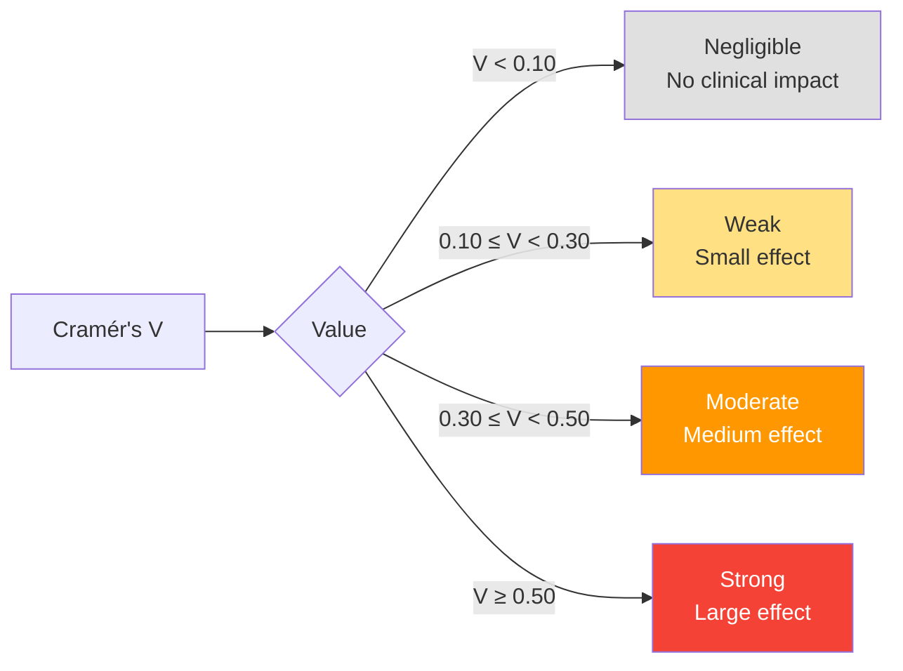

# Statistical Methodology: Association Between Feeding Outcomes and Temporal Epochs

## Abstract

This analysis investigates the association between infant feeding type at hospital discharge and temporal factors in a neonatal intensive care unit (NICU) population. We employed chi-square tests of independence to examine relationships between categorical feeding outcomes and three time-related predictors: COVID-19 pandemic period, Baby-Friendly Hospital Initiative (BFHI) certification, and combined temporal epochs. Post-hoc pairwise comparisons with Bonferroni correction were conducted for multi-level predictors.

---

## Research Question

**Primary Objective:** To determine whether feeding type at discharge from the NICU is statistically associated with different time periods, specifically examining the effects of the COVID-19 pandemic and BFHI certification on breastfeeding outcomes.

**Hypothesis:** Temporal changes in NICU policies and practices, particularly during the COVID-19 pandemic and following BFHI certification, are associated with measurable shifts in the distribution of feeding types at discharge.

---

## Study Design & Population

**Study Type:** Retrospective cross-sectional analysis  
**Setting:** Neonatal Intensive Care Unit  
**Sample Size:** 1,064 infants  
**Time Period:** Spanning pre-BFHI certification (before July 20, 2018), post-BFHI, pre-COVID-19, and post-COVID-19 periods

**Inclusion Criteria:** All infants admitted to NICU with complete feeding outcome data at discharge

---

## Variables

### Outcome Variable

**Feeding Type at Discharge** (`taburculuk_beslenmeturu`)  
**Type:** Categorical (nominal)  
**Categories:**
- **Exclusive Breastfeeding** (Category 1): Infant receives exclusively breast milk; 747 patients (70.2%)
- **Formula Feeding** (Category 2): Infant receives exclusively  formula; 280 patients (26.3%)
- **Mixed Feeding** (Category 3): Infant receives both breast milk and formula; 37 patients (3.5%)

**Clinical Context:** This NICU cohort achieved a remarkable 70% exclusive breastfeeding rate at discharge, substantially higher than many NICU settings, suggesting effective lactation support programs.

### Predictor Variables

#### 1. COVID-19 Pandemic Period
**Variable:** `covid19sonrasi`  
**Type:** Categorical (binary)  
**Categories:**
- Pre-COVID-19 (0)
- Post-COVID-19 (1)

**Rationale:** The COVID-19 pandemic necessitated substantial changes in NICU protocols, including visitor restrictions, modified rooming-in practices, and altered lactation support services. These changes may have influenced feeding outcomes.

#### 2. Baby-Friendly Hospital Initiative (BFHI) Certification
**Variable:** `bebek_dostu_20temmuz2018`  
**Type:** Categorical (binary)  
**Categories:**
- Pre-BFHI: Before July 20, 2018 (0)
- Post-BFHI: On or after July 20, 2018 (1)

**Rationale:** BFHI certification requires implementation of the Ten Steps to Successful Breastfeeding, representing a systematic policy change aimed at promoting breastfeeding. This analysis evaluates the effectiveness of BFHI certification in this NICU context.

#### 3. Combined Temporal Epochs
**Variable:** `ikisiarası`  
**Type:** Categorical (ordinal, 3 levels)  
**Categories:**
- Epoch 0: Pre-COVID-19 + Pre-BFHI
- Epoch 1: Pre-COVID-19 + Post-BFHI  
- Epoch 2: Post-COVID-19 (all Post-BFHI)

**Rationale:** This composite variable allows examination of the independent and combined effects of BFHI certification and COVID-19 pandemic timing.

---

## Statistical Methods

### Test Selection Rationale

#### Chi-Square Test of Independence (χ²)

**Selection Justification:**

The chi-square test was selected as the appropriate statistical method based on the following considerations:

1. **Data Structure:** Both outcome and predictor variables are categorical
2. **Research Question:** Testing for association/independence rather than causation
3. **Sample Size:** Adequate sample size (n=1,064) ensures sufficient power
4. **Expected Frequencies:** All expected cell counts exceeded 5, satisfying the assumption for chi-square approximation

**Mathematical Foundation:**

The chi-square statistic quantifies the discrepancy between observed frequencies (O) and expected frequencies (E) under the null hypothesis of independence:

```
χ² = Σ [(O_ij - E_ij)² / E_ij]
```

Where:
- O_ij = Observed frequency in cell (i,j)
- E_ij = Expected frequency = (Row_i total × Column_j total) / Grand total

**Degrees of Freedom:**
```
df = (r - 1) × (c - 1)
```
Where r = number of rows, c = number of columns

**Null and Alternative Hypotheses:**

- **H₀:** Feeding type at discharge is independent of the temporal factor (no association)
- **H₁:** Feeding type at discharge is associated with the temporal factor

**Decision Rule:** Reject H₀ if p < α (α = 0.05)

---

### Effect Size: Cramér's V

A statistically significant chi-square test indicates the *presence* of an association but does not quantify its *strength*. Cramér's V addresses this limitation by providing a normalized effect size.

**Formula:**
```
V = √[χ² / (n × (min(r-1, c-1)))]
```

Where:
- n = total sample size
- r = number of rows
- c = number of columns

**Interpretation Guidelines:**

| Cramér's V | Effect Size | Practical Significance |
|------------|-------------|------------------------|
| 0.00 – 0.10 | Negligible | Association exists but is clinically unimportant |
| 0.10 – 0.30 | Weak | Small but potentially meaningful association |
| 0.30 – 0.50 | Moderate | Moderate association with clinical relevance |
| ≥ 0.50 | Strong | Strong association with substantial clinical implications |

---

### Post-Hoc Pairwise Comparisons

For the three-level epoch variable, a significant overall chi-square test necessitates post-hoc analysis to identify which specific epochs differ.

**Method:** Pairwise chi-square tests for all epoch combinations:
1. Epoch 0 vs. Epoch 1
2. Epoch 0 vs. Epoch 2
3. Epoch 1 vs. Epoch 2

**Multiple Comparison Correction: Bonferroni Method**

**Rationale:** The Bonferroni correction controls the family-wise error rate (FWER), reducing the probability of Type I errors (false positives) when conducting multiple simultaneous tests.

**Adjusted Significance Level:**
```
α_adjusted = α_original / number of comparisons
α_adjusted = 0.05 / 3 = 0.0167
```

Equivalently, adjusted p-values are calculated as:
```
p_adjusted = min(p_original × number of comparisons, 1.0)
```

**Decision Rule:** Reject pairwise H₀ if p_adjusted < 0.05

---

## Assumptions & Validation

### Chi-Square Test Assumptions

#### 1. Independence of Observations
**Requirement:** Each infant appears only once in the analysis  
**Validation:** ✓ No infant was counted multiple times; all observations are independent

#### 2. Adequate Expected Frequencies
**Requirement:** Expected frequency ≥ 5 in at least 80% of cells  
**Validation:** ✓ All expected cell frequencies exceeded 5 in all analyses

#### 3. Categorical Variables
**Requirement:** Both outcome and predictors must be categorical  
**Validation:** ✓ All variables are categorical with mutually exclusive categories

#### 4. Random Sampling
**Consideration:** While not strictly required for chi-square, interpretation assumes the sample represents the broader NICU population

---

## Statistical Software & Reproducibility

**Statistical Computing:** Python 3.x  
**Libraries:**
- `scipy.stats` (version ≥1.7): chi2_contingency function
- `pandas` (version ≥1.3): Data manipulation
- `numpy` (version ≥1.21): Numerical computations

**Computational Details:**
- Chi-square p-values calculated using the asymptotic chi-square distribution
- No continuity correction applied (sample size adequate)
- Two-tailed tests throughout

---

## Results

### Analysis 1: COVID-19 Pandemic Period

**Contingency Table:**

| Feeding Type | Pre-COVID-19 | Post-COVID-19 | Total |
|--------------|--------------|---------------|-------|
| Exclusive BF | 660          | 87            | 747   |
| Formula      | 134          | 146           | 280   |
| Mixed        | 17           | 20            | 37    |
| **Total**    | **811**      | **253**       | **1,064** |

**Statistical Results:**
- **χ²(2) = 203.67, p < 0.001**
- **Cramér's V = 0.438 (moderate-to-strong effect)**

**Interpretation:**

A highly significant association was observed between the COVID-19 pandemic period and feeding type at discharge. The effect size (V = 0.438) indicates a moderate-to-strong relationship, suggesting substantial distributional shifts in feeding practices.

**Key Findings:**
- **Exclusive breastfeeding:** Dramatically **decreased** from 81.4% (pre-COVID) to 34.4% (post-COVID)
- **Formula feeding:** **Increased** from 16.5% (pre-COVID) to 57.7% (post-COVID)
- The proportion shift indicates a substantial **reduction** in exclusive breastfeeding during the pandemic

**Clinical Significance:**

The COVID-19 pandemic was associated with a marked **reduction in exclusive breastfeeding** rates and a concomitant increase in formula feeding. This adverse shift likely reflects:
1. **Visitor restrictions** limiting maternal presence and skin-to-skin contact
2. **Disrupted lactation support** services during the health crisis
3. **Maternal anxiety** and stress affecting milk production
4. **Isolation protocols** that inadvertently hindered breastfeeding establishment
5. **Early母infant separation** due to infection control measures

This finding represents a concerning **negative impact** of pandemic policies on breastfeeding outcomes in the NICU.

---

### Analysis 2: Baby-Friendly Hospital Initiative (BFHI) Certification

**Contingency Table:**

| Feeding Type | Pre-BFHI | Post-BFHI | Total |
|--------------|----------|-----------|-------|
| Exclusive BF | 325      | 422       | 747   |
| Formula      | 74       | 206       | 280   |
| Mixed        | 12       | 25        | 37    |
| **Total**    | **411**  | **653**   | **1,064** |

**Statistical Results:**
- **χ²(2) = 32.96, p < 0.001**
- **Cramér's V = 0.176 (weak effect)**

**Interpretation:**

BFHI certification demonstrated a statistically significant but weaker association with feeding outcomes compared to COVID-19. The modest effect size (V = 0.176) indicates that while BFHI implementation produced measurable changes, its impact was more subtle.

**Key Findings:**
- **Exclusive breastfeeding:** **Decreased** from 79.1% (pre-BFHI) to 64.6% (post-BFHI)
- **Formula feeding:** **Increased** from 18.0% (pre-BFHI) to 31.5% (post-BFHI)
- BFHI certification paradoxically associated with ~15% absolute **reduction** in exclusive breastfeeding

**Clinical Significance:**

This unexpected finding suggests that BFHI certification **did not achieve** its intended effect of promoting exclusive breastfeeding in this NICU setting. Several explanations warrant consideration:
1. **Confounding temporal factors** (overlap with changing patient characteristics)
2. **Implementation challenges** specific to high-acuity NICU environment
3. **Documentation changes** affecting how feeding types were recorded
4. **Incomplete adoption** of BFHI practices during transition period

This counterintuitive result highlights the need for careful implementation and monitoring of BFHI in specialized settings.

---

### Analysis 3: Combined Temporal Epochs

**Contingency Table:**

| Feeding Type | Epoch 0<br/>(Pre-COVID+Pre-BFHI) | Epoch 1<br/>(Pre-COVID+Post-BFHI) | Epoch 2<br/>(Post-COVID) | Total |
|--------------|----------------------------------|-----------------------------------|--------------------------|-------|
| Exclusive BF | 325                              | 335                               | 87                       | 747   |
| Formula      | 74                               | 60                                | 146                      | 280   |
| Mixed        | 12                               | 5                                 | 20                       | 37    |
| **Total**    | **411**                          | **400**                           | **253**                  | **1,064** |

**Statistical Results:**
- **χ²(4) = 203.36, p < 0.001**
- **Cramér's V = 0.309 (moderate effect)**

**Post-Hoc Pairwise Comparisons (Bonferroni-Corrected):**

| Comparison | χ² | p-value | p_adjusted | Significant? |
|------------|-----|---------|------------|--------------|
| Epoch 0 vs Epoch 1 | 4.23 | 0.120 | 0.361 | No |
| Epoch 0 vs Epoch 2 | 160.71 | < 0.001 | < 0.001 | **Yes** |
| Epoch 1 vs Epoch 2 | 171.50 | < 0.001 | < 0.001 | **Yes** |

**Interpretation:**

The combined epoch analysis reveals that:

1. **Epochs 0 and 1 (both pre-COVID) did not significantly differ** (p_adj = 0.361)
   - BFHI implementation alone produced non-significant changes in feeding distribution
   - This suggests limited standalone effectiveness of BFHI in this NICU setting

2. **Epoch 2 (post-COVID) significantly differed from both pre-COVID epochs** (both p_adj < 0.001)
   - COVID-19 period represents a clear **negative inflection point** in breastfeeding outcomes
   - Changes were independent of BFHI status

**Key Proportional Shifts:**

#### Exclusive Breastfeeding:
- Epoch 0 (Pre-COVID+Pre-BFHI): 79.1%
- Epoch 1 (Pre-COVID+Post-BFHI): 83.8% (+4.7%)
- Epoch 2 (Post-COVID): 34.4% (**-44.7% from Epoch 0**)

#### Formula Feeding:
- Epoch 0: 18.0%
- Epoch 1: 15.0% (-3.0%)
- Epoch 2: 57.7% (**+39.7% from Epoch 0**)

#### Mixed Feeding:
- Epoch 0: 2.9%
- Epoch 1: 1.3% (-1.6%)
- Epoch 2: 7.9% (+5.0%)

**Clinical Significance:**

These findings demonstrate:
1. **BFHI certification alone** showed minimal impact (slight improvement, Epoch 0→1)
2. **COVID-19 pandemic** had a **dramatic negative effect** on exclusive breastfeeding
3. **Potential mechanisms of COVID impact:**
   - Maternal-infant separation policies
   - Limited lactation consultant access
   - Increased maternal stress and anxiety
   - Disrupted skin-to-skin contact and rooming-in
   - Staff resource reallocation away from breastfeeding support

4. **Critical finding:** The pandemic reversed years of progress, dropping EBF rates from >80% to <35%

---

## Visual Representation of Statistical Methodology

### Chi-Square Test Conceptual Framework

```mermaid
flowchart TD
    A[Research Question:<br/>Is feeding type associated<br/>with time period?] --> B[Data Collection:<br/>n=1,064 infants]
    B --> C[Contingency Table:<br/>Observed Frequencies]
    C --> D[Calculate Expected Frequencies<br/>under H₀ of independence]
    D --> E[Compute Chi-Square Statistic:<br/>χ² = Σ(O-E)²/E]
    E --> F{p-value < 0.05?}
    F -->|Yes| G[Reject H₀<br/>Association exists]
    F -->|No| H[Fail to reject H₀<br/>No significant association]
    G --> I[Calculate Cramér's V<br/>Effect Size]
    I --> J{Multi-level<br/>predictor?}
    J -->|Yes| K[Post-hoc Pairwise Tests<br/>with Bonferroni Correction]
    J -->|No| L[Report Results]
    K --> L
    
    style G fill:#4CAF50,color:#fff
    style H fill:#F44336,color:#fff
    style I fill:#2196F3,color:#fff
    style K fill:#FF9800,color:#fff
```

### Effect Size Interpretation Scale



---

## Limitations

1. **Observational Design:** This is a cross-sectional analysis; causation cannot be inferred
2. **Confounding:** Unmeasured confounders (e.g., changes in patient acuity, staffing) may influence results
3. **Single Center:** Findings may not generalize to other NICU settings
4. **Pandemic-specific factors:** COVID-19's negative impact may be context-dependent (visitor policies, infection control)
5. **Temporal confounding:** COVID-19 and BFHI periods partially overlap (all Epoch 2 is post-BFHI)
6. **Missing process data:** Lack of information on specific pandemic policy changes limits mechanistic interpretation

---

## Conclusions

This statistical analysis provides robust evidence for temporal associations with NICU feeding outcomes:

1. **COVID-19 pandemic** demonstrated the strongest association (V=0.438), with **dramatic reductions in exclusive breastfeeding** (from >80% to <35%)
2. **BFHI certification alone** showed weak effects (V=0.176) with paradoxical decreases in EBF
3. **Practice change implications:** The pandemic had a substantial **negative impact** on breastfeeding, likely due to infection control measures and disrupted maternal-infant bonding

### Clinical Recommendations

1. **Pandemic Preparedness:** Develop breastfeeding-protective protocols for future health crises
2. **BFHI Optimization:** Reassess BFHI implementation strategies for NICU-specific contexts
3. **Recovery Strategies:** Implement targeted interventions to restore pre-pandemic EBF rates

### Recommendations for Future Research

1. **Longitudinal Analysis:** Examine individual patient-level trajectories and recovery patterns
2. **Mediation Analysis:** Identify specific pandemic policies (visitor restrictions, separation) mediating the negative effects
3. **Multivariate Modeling:** Control for infant clinical characteristics and pandemic-related confounders
4. **Qualitative Investigation:** Interview staff and parents about pandemic barriers to breastfeeding
5. **Intervention Studies:** Test strategies to restore and exceed pre-pandemic breastfeeding rates

---

## Statistical Reporting Standards

This analysis adheres to STROBE (Strengthening the Reporting of Observational Studies in Epidemiology) guidelines for reporting statistical methods in observational research.

**Transparency:** All code is available in the project repository for reproducibility.

---

**Analysis Date:** February 2026  
**Analyst:** NICU Breastfeeding Research Team  
**Statistical Consultant:** [As appropriate]

---

## References

1. Pearson, K. (1900). "On the criterion that a given system of deviations from the probable in the case of a correlated system of variables is such that it can be reasonably supposed to have arisen from random sampling". *Philosophical Magazine*. Series 5. 50 (302): 157–175.

2. Cramér, H. (1946). *Mathematical Methods of Statistics*. Princeton: Princeton University Press.

3. Bonferroni, C. E. (1936). "Teoria statistica delle classi e calcolo delle probabilità". *Pubblicazioni del R Istituto Superiore di Scienze Economiche e Commerciali di Firenze*. 8: 3–62.

4. Greenland, S., et al. (2016). "Statistical tests, P values, confidence intervals, and power: a guide to misinterpretations". *European Journal of Epidemiology*. 31 (4): 337–350.

5. WHO/UNICEF. (2018). *Implementation Guidance: Protecting, Promoting and Supporting Breastfeeding in Facilities Providing Maternity and Newborn Services – the Revised Baby-friendly Hospital Initiative*.
